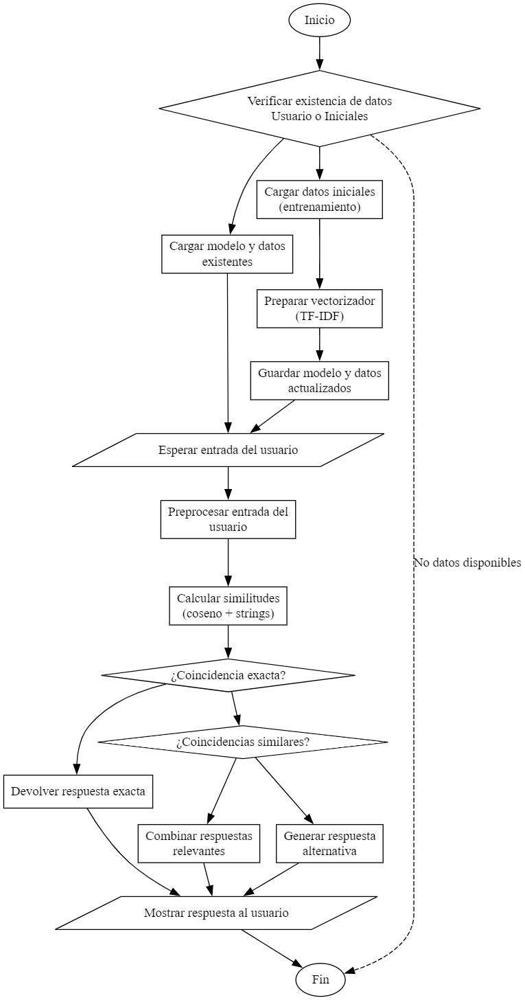

# Manual Tecnico de USATBOT

*Universidad de San Carlos de Guatemala*  
*Escuela de Ingeniería en Ciencias y Sistemas, Facultad de Ingenieria*  
*Inteligencia Artificial 1, Vacaciones de Diciembre 2024.*  
*Grupo 6*  

| Nombre | Carnet |
| -------- | -------- |
| William Adolfo Mazariegos García    | 202100123     |
| Damaris Julizza Muralles Véliz     | 202100953  |
| Angel David Torcelli Barrios  | 201801169    |


# Archivo main.py
El codigo completo del programa esta en el archivo [`main.py`](../main.py), el cual contiene la logica principal del chatbot y la interfaz grafica. A continuacion se detallan las partes mas importantes del codigo. A continuacion se muestra un diagrama de flujo del programa.




## 1. **Importación de bibliotecas y configuraciones iniciales**

```python
import tkinter as tk
from tkinter import ttk
from tkinter import scrolledtext
from sklearn.feature_extraction.text import TfidfVectorizer
import pandas as pd
from idioma_chat import detectar_lang, traducir
from sklearn.metrics.pairwise import cosine_similarity
import nltk
from nltk.tokenize import word_tokenize
from nltk.corpus import stopwords
from nltk.stem import WordNetLemmatizer
from difflib import SequenceMatcher
import re
import joblib
import os
```

- **Objetivo**: Importar bibliotecas necesarias para procesamiento de lenguaje natural, manejo de datos, y la interfaz gráfica.
- **Detalles**:
  - `tkinter`: Crear la interfaz gráfica (ventanas, botones, áreas de texto, etc.).
  - `TfidfVectorizer`: Transformar texto en vectores TF-IDF.
  - `pandas`: Manejo de datos estructurados.
  - `nltk`: Procesamiento del lenguaje natural, como tokenización y eliminación de stopwords.
  - `joblib`: Guardar y cargar modelos o datos procesados.
  - `re`: Manejo de expresiones regulares.

---

## 2. **Clase `ProgrammingChatbot`**

Esta clase implementa la lógica principal del chatbot.

### Constructor `__init__`

```python
def __init__(self, initial_data_path, user_data_path='chat_data_user.csv', similarity_threshold=0.3, exact_match_threshold=0.9, vectorizer_path='tfidf_vectorizer.pkl'):
```

- **Función**: Inicializa el chatbot.
- **Detalles**:
  - Carga datos iniciales o entrenados por el usuario.
  - Configura los umbrales de similitud (`similarity_threshold` y `exact_match_threshold`).
  - Define rutas de archivos de datos (`initial_data_path` y `user_data_path`).

---

### Métodos principales

#### `load_data`

```python
def load_data(self, data_path):
```

- **Función**: Carga y prepara datos desde un archivo CSV.
- **Detalles**:
  - Filtra filas con preguntas/respuestas vacías.
  - Preprocesa las preguntas usando `self.preprocess_text`.

#### `add_training_data`

```python
def add_training_data(self, question, answer):
```

- **Función**: Añade nuevas preguntas y respuestas a los datos existentes.
- **Detalles**:
  - Preprocesa la nueva pregunta.
  - Actualiza el modelo con el nuevo dato.
  - Guarda los datos en el archivo del usuario.

#### `save_training_data`

```python
def save_training_data(self, filepath):
```

- **Función**: Guarda los datos de entrenamiento en un archivo CSV.

#### `save_model` y `load_model`

```python
def save_model(self, vectorizer_path, data_path):
```

- **Función**: Guarda el vectorizador y los datos procesados.

```python
def load_model(self, vectorizer_path, data_path):
```

- **Función**: Carga el vectorizador y los datos procesados.

---

### Procesamiento de texto

#### `preprocess_text`

```python
def preprocess_text(self, text):
```

- **Función**: Preprocesa texto para convertirlo en un formato más uniforme.
- **Detalles**:
  - Elimina caracteres especiales y convierte a minúsculas.
  - Elimina stopwords comunes excepto aquellas útiles en preguntas (e.g., "what", "how").
  - Realiza lematización y reemplaza términos de programación con palabras clave más comunes.

#### `prepare_vectorizer`

```python
def prepare_vectorizer(self):
```

- **Función**: Configura y entrena el vectorizador TF-IDF.
- **Detalles**:
  - Usa bigramas (pares de palabras consecutivas).
  - Configura una lista personalizada de stopwords.

---

### Búsqueda y respuestas

#### `find_similar_questions`

```python
def find_similar_questions(self, processed_input):
```

- **Función**: Encuentra preguntas similares en el conjunto de datos.
- **Detalles**:
  - Calcula similitud usando coseno y similitud de cadenas.
  - Combina ambas medidas para priorizar coincidencias relevantes.

#### `get_response`

```python
def get_response(self, user_input):
```

- **Función**: Obtiene la respuesta más relevante para la pregunta del usuario.
- **Detalles**:
  - Si no encuentra coincidencias suficientes, llama a `get_fallback_response`.

#### `get_fallback_response`

```python
def get_fallback_response(self, processed_input):
```

- **Función**: Genera una respuesta genérica si no encuentra coincidencias.

#### `combine_responses`

```python
def combine_responses(self, responses, original_question):
```

- **Función**: Combina múltiples respuestas relevantes en una sola.

---

## 3. **Funciones de la interfaz gráfica**

### Configuración de la ventana

```python
root = tk.Tk()
root.title("UsatBot")
root.geometry(f"{width}x{height}+{x}+{y}")
root.configure(bg="#202020")
```

- **Función**: Configura la ventana principal de la aplicación.

### Componentes principales

#### Área de mensajes

```python
message_area = scrolledtext.ScrolledText(...)
```

- **Función**: Muestra mensajes del usuario y respuestas del chatbot.
- **Detalles**:
  - Configuración de colores y fuentes para diferentes tipos de mensajes.

#### Entrada de texto

```python
message_entry = tk.Entry(...)
```

- **Función**: Permite al usuario escribir preguntas.

#### Botón de enviar

```python
send_button = tk.Button(...)
```

- **Función**: Envía el mensaje ingresado por el usuario.

---

### Funciones auxiliares

#### `display_message`

```python
def display_message(message, side):
```

- **Función**: Muestra mensajes en el área de texto.

#### `send_message`

```python
def send_message(event=None):
```

- **Función**: Captura el mensaje del usuario, lo procesa y muestra la respuesta del chatbot.

#### `receive_message` y `process_vt`

```python
def receive_message(message):
def process_vt(vt, index):
```

- **Función**: Muestra la respuesta del chatbot con efecto de tipeo.

#### `disable_send_button` y `enable_send_button`

```python
def disable_send_button():
def enable_send_button():
```

- **Función**: Habilitan o deshabilitan el botón de enviar.

---

## 4. **Ejecución del programa**

```python
chatbot = ProgrammingChatbot("chat_data.csv", similarity_threshold=0.4, exact_match_threshold=0.90)
root.mainloop()
```

- **Función**: Crea el objeto `ProgrammingChatbot` y ejecuta la interfaz gráfica.


