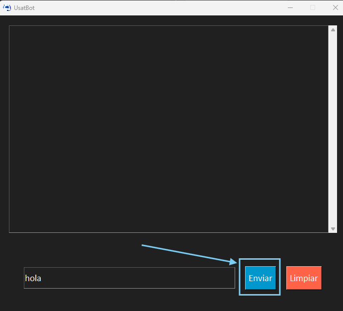
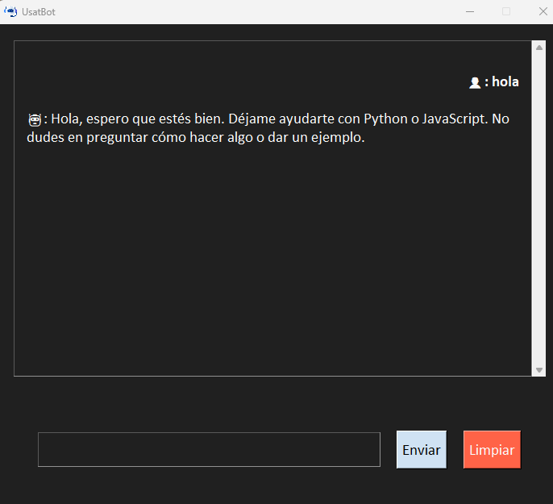
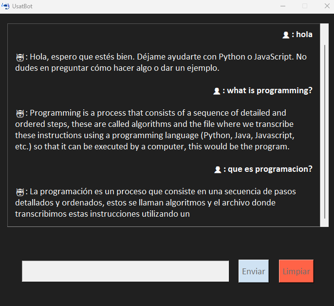
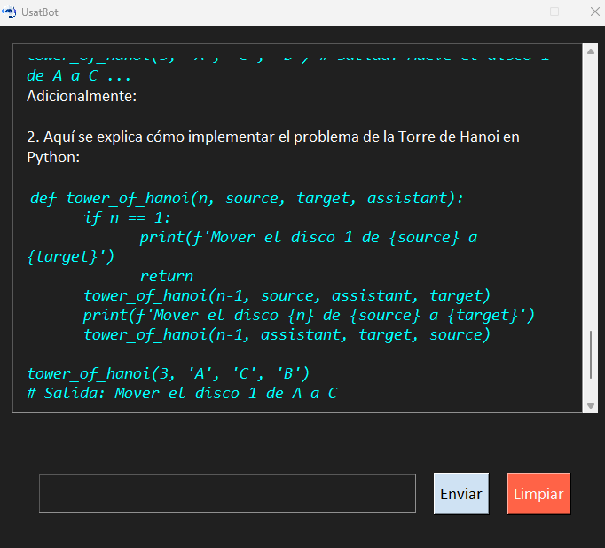

# Manual de Usuario de USATBOT

*Universidad de San Carlos de Guatemala*  
*Escuela de Ingeniería en Ciencias y Sistemas, Facultad de Ingenieria*  
*Inteligencia Artificial 1, Vacaciones de Diciembre 2024.*  
*Grupo 6*  

| Nombre | Carnet |
| -------- | -------- |
| William Adolfo Mazariegos García    | 202100123     |
| Damaris Julizza Muralles Véliz     | 202100953  |
| Angel David Torcelli Barrios  | 201801169    |

## Índice
1. [Introducción](#introducción)
2. [Acceso a UsatBot](#acceso-a-usatbot)
3. [Uso de UsatBot](#uso-de-usatbot)
    1. [¿Cómo enviar tu mensaje?](#1-enviar-un-mensaje)
    2. [¿Cómo obtienes una respuesta?](#2-obten-respuestas)
    3. [¿Qué tipo de preguntas puedes hacer a UsatBot?](#3-preguntas-que-puedes-hacer)

4. [Características](#características)

## Introducción

**UsatBot** es un chatbot que utiliza un modelo de inteligencia artificial para mantener conversaciones con los usuarios.  A través de una interfaz sencilla, los usuarios pueden chatear con UsatBot de forma directa.

## Acceso a UsatBot

1. **Ejecutable:** [Haz clik aquí para ir al ejecutable]().

2. **Codigo:** Puede Descargar este repositorio y ejecutarlo por medio de `python main.py`. Inicialmente hara un entrenamiento si no tiene el archivo `chat_data_user.csv`, de lo contrario se inicializara inmediatamente.

3. **Interfaz:** Una vez acceda a la app, podrá ver la siguiente interfaz de inicio.

## Uso de UsatBot

### 1. Enviar un mensaje

- **Escribe tu mensaje:** En la parte inferior de la ventana de chat, hay un cuadro de texto donde puedes escribir tu pregunta.

- **Envía el mensaje:** Haz clic en el botón de enviar para que UsatBot procese tu mensaje y te responda.

### 2. Obten respuestas

UsatBot responderá automáticamente cuando envies tu mensaje. Además, podrás seguir enviando preguntas para continuar la conversación de manera fluida.

### 3. Preguntas que puedes hacer

UsatBot está diseñado para responder preguntas relacionadas con programación, específicamente sobre Python y JavaScript, proporcionando información útil. Además, puedes consultarle sobre la generación de código que va desde algo básico como a generación de algoritmos.

El chatbot admite preguntas tanto en español como en inglés y responderá en el mismo idioma en el que se le consulte. También es capaz de mantener una conversación sencilla, lo que facilita la interacción.

Ten en cuenta que, debido a ciertas limitaciones, UsatBot podría no comprender algunas preguntas o proporcionar respuestas incompletas. Esto se debe a que su capacidad aún está en una etapa inicial de desarrollo.

Sin embargo, al pasar esto hay ocaciones que puede darte varias respuestas que el considere se aproximan a lo que preguntaste.

## Características

UsatBot utiliza un modelo de IA entrenado previamente y no requiere intervención del usuario para mejorar o modificar las respuestas. Si es primera vez que  usas UsatBot, espera un momento mientras el modelo se entrena. Una vez que el modelo esté listo, podrás comenzar a chatear, Despues de eso, el entrenamiento no será necesario nuevamente.

Ademas el diseño de UsatBot está optimizado para ofrecer una experiencia de usuario sencilla y fluida, sin complicaciones.

